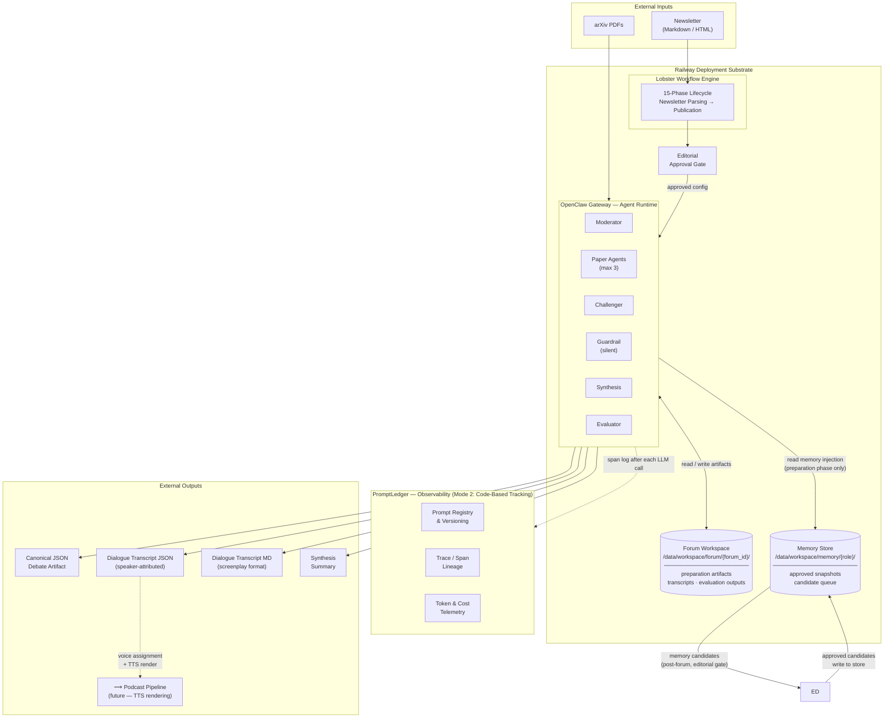

# Synthetic Research Forum (SRF) — System Architecture Specification v2.0

Version: 2.0
Date: 2026‑03‑17
Status: Architecture Baseline (Delivery Epics Externalized)

---

## System Architecture Diagram



> **Trace hierarchy within PromptLedger:**
> `trace (forum_id)` → `phase spans` → `turn spans` → `guardrail child spans`
>
> PromptLedger is observability infrastructure only. SRF calls the configured LLM provider directly (Mode 2) — provider is runtime config, not code.
> If `PROMPTLEDGER_API_URL` is absent the system runs without observability — it does not crash.

---

## 1. Purpose

Synthetic Research Forum (SRF) is a deterministic multi‑agent epistemic discussion system designed to:

- pressure‑test research papers
- surface meaningful intellectual tensions
- generate structured synthesis artifacts
- enable longitudinal improvement via governed prompt evolution

SRF is not a conversational playground.  
It is an **intellectual execution engine.**

This document defines:

- system architecture
- agent topology
- execution lifecycle
- debate mechanics
- data contracts
- observability integration
- success criteria

It intentionally does **not** contain backlog stories, sprint sequencing, or task breakdowns.

---

## 2. Architectural Principles

1. Deterministic workflow execution
2. Explicit epistemic pressure model
3. Preparation‑driven debate quality
4. Durable agent workspaces across sleep cycles
5. Prompt governance before behavioral sophistication
6. Full execution lineage and cost observability
7. Editorial authority over policy evolution
8. Provider‑agnostic LLM integration — the active provider, model, and credentials are runtime configuration; no provider SDK is hardcoded into agent or workflow logic
9. Behavioral memory, not encyclopedic memory — historical memory exists to improve epistemic rigor, preparation quality, and execution stability across debates; it is role‑scoped, editorially gated, and never written autonomously by agents

---

## 3. High‑Level System Architecture

SRF runs as a headless workflow system.

Core runtime components:

- OpenClaw Gateway (agent runtime)
- Lobster Workflow Engine (phase orchestration)
- PromptLedger (prompt registry + tracing + telemetry)
- Railway deployment substrate

LLM provider is runtime configuration (`SRF_LLM_PROVIDER` / `SRF_LLM_MODEL` / `SRF_LLM_API_KEY`). SRF ships no hardcoded provider dependency. Switching providers requires only environment variable changes — no code changes, no redeployment of agent logic.

Persistent storage:

- `/data/workspace/forum/{forum_id}/`
- cached paper extractions
- preparation artifacts
- transcripts
- evaluation outputs

External inputs:

- weekly newsletter artifact (Markdown / HTML)
- arXiv PDFs

External outputs:

- canonical JSON debate artifact
- dialogue transcript JSON (speaker‑attributed, podcast‑pipeline‑ready)
- dialogue transcript Markdown (screenplay format, human‑readable)
- synthesis summary

---

## 4. Execution Lifecycle

End‑to‑end lifecycle:

1. Newsletter Parsing  
2. Candidate Config Generation  
3. Editorial Approval  
4. Workspace Generation  
5. Preparation Phase  
6. Opening  
7. Position Statements  
8. Challenger Entry  
9. Open Discussion  
10. Closing Statements  
11. Synthesis  
12. Contribution Evaluation  
13. Editorial Review  
14. Optional Policy Proposal  
15. Publication

Each lifecycle stage is represented as a Lobster phase.

---

## 5. Participant Model

### 5.1 Moderator

Role: debate facilitator and convergence enforcer.

Responsibilities:

- frame topic and tensions
- monitor rigor and flow
- inject challenger pressure when needed
- force convergence near turn budget exhaustion

Moderator never defends a thesis.

---

### 5.2 Paper Agents (max 3)

Role: defend assigned research paper and challenge competing positions.

Responsibilities:

- argue strictly from grounded paper content
- cite methods / results / limitations
- challenge other agents directly
- adapt strategy based on evolving debate state
- concede documented limitations

---

### 5.3 Challenger Agent

Role: structured epistemic pressure.

Not grounded in a single paper.

Responsibilities:

- expose hidden assumptions
- force cross‑paper comparison
- introduce deployment / methodology / scope constraints
- restore rigor when peer pressure weakens

Challenger speaks periodically, not continuously.

---

### 5.4 Guardrail Agent

Role: silent real‑time evaluator.

Checks:

- fabricated evidence
- grounding violations
- evasion
- tone drift
- comparison distortion
- pressure overreach

CRITICAL alerts override routing.

---

### 5.5 Synthesis Agent

Role: structured post‑discussion analyst.

Produces:

- agreements
- tensions
- unresolved questions
- editorial framing

No new claims permitted.

---

### 5.6 Evaluation Agent

Role: post‑hoc contribution scoring.

Scores:

- paper agents
- challenger
- moderator
- synthesis quality

Outputs provisional scorecard for editorial adjustment.

---

## 6. Preparation Phase

Preparation is mandatory and executed before the first live turn.

Each agent's preparation context includes two inputs: (1) forum‑specific material (paper content, topic framing) and (2) an approved **memory injection block** drawn from the role memory store (see §10). The memory block is bounded by a token budget and version‑stamped so that any forum run is fully reproducible from its config + memory snapshot version + prompt versions.

Artifacts produced:

### Paper Agents

- thesis summary
- evidence map
- anticipated criticisms
- attack targets
- concession boundaries

### Challenger

- vulnerability hypotheses
- comparison axes
- forcing questions
- stress strategy

### Moderator

- debate topology map
- intervention triggers
- convergence plan

### Guardrail

- claim index
- benchmark reference index

### Synthesis

- tension taxonomy
- novelty detection heuristics

Debate may not start until preparation completeness = TRUE.

---

## 7. Discussion Protocol

### Phase Turn Budget

| Phase | Turns |
|------|------|
Opening | 1
Position Statements | 3
Challenger Entry | 1
Open Discussion | 10‑14
Closing | 4
Synthesis | 1

---

### Hybrid Pressure Model

Pressure sources:

- peer challenge
- challenger pressure
- moderator structural enforcement

---

### Routing Priority Stack

1. CRITICAL guardrail override  
2. unresolved direct challenge  
3. moderator intervention  
4. challenger injection  
5. otherwise challenged participant responds

---

### Engagement Rules

Paper Agents must:

- answer direct challenges
- cite evidence
- acknowledge gaps
- avoid repeating weak attacks
- adapt strategy dynamically

Challenger must:

- ground critique in transcript
- force comparison
- avoid hidden thesis advocacy

Moderator must:

- prefer self‑sustaining debate
- intervene only when rigor degrades
- force endgame convergence

---

## 8. Debate State Model

Each active participant maintains internal state:

- active disputed claims
- unanswered questions
- exposed assumptions
- comparison axes
- coalition signals
- guardrail alerts
- remaining high‑leverage moves

This enables **adaptive triangulation.**

---

## 9. Output Contract

### 9.1 Canonical JSON Debate Artifact

`debate_artifact.json` — the authoritative machine‑readable record of a completed forum run.

Top‑level fields:

- `forum_id`
- `topic`
- `framing_question`
- `paper_metadata` — one entry per paper agent: `{ paper_id, title, arxiv_id, agent_id }`
- `challenger_metadata`
- `dialogue_transcript` — ordered list of turns (see §9.2)
- `synthesis_block`
- `evaluation_block`
- `preparation_completeness`
- `execution_metadata` — `{ model, provider, forum_date, total_turns, total_cost }`

---

### 9.2 Dialogue Transcript — Speaker‑Attributed Format

The dialogue transcript is the canonical record of every spoken turn. It is a first‑class output artifact designed to be:

1. **Human‑readable** — can be reviewed without tooling
2. **Machine‑parseable** — structured JSON for downstream processing
3. **Podcast‑pipeline‑ready** — every turn carries the speaker identity and clean prose content required for text‑to‑speech rendering without post‑processing

#### Turn schema

Each entry in `dialogue_transcript` contains:

```json
{
  "turn": 7,
  "phase": "open_discussion",
  "speaker": {
    "agent_id": "paper_agent_1",
    "role": "paper_agent",
    "display_name": "Vaswani et al. (2017)",
    "voice_persona": "confident, precise"
  },
  "addressed_to": ["paper_agent_2"],
  "content": "...",
  "challenge_type": "evidence_dispute",
  "comparison_axis": "benchmark_scope",
  "strategy_shift": false,
  "guardrail_alerts": []
}
```

Field definitions:

| Field | Type | Description |
|---|---|---|
| `turn` | integer | Sequential turn number across the entire debate (1‑based) |
| `phase` | string | Lifecycle phase name: `opening`, `position_statements`, `challenger_entry`, `open_discussion`, `closing`, `synthesis` |
| `speaker.agent_id` | string | Stable machine identifier: `moderator`, `paper_agent_1`–`3`, `challenger`, `synthesis`, `evaluator` |
| `speaker.role` | string | Agent role class: `moderator`, `paper_agent`, `challenger`, `synthesis`, `evaluator` |
| `speaker.display_name` | string | Human‑readable name shown in the transcript — for paper agents this is the paper's short citation; for the moderator it is `"Moderator"` |
| `speaker.voice_persona` | string | Optional adjective pair describing suggested vocal character for TTS assignment (e.g. `"skeptical, incisive"`). Set in forum config; may be null |
| `addressed_to` | array\|null | List of `agent_id` values this turn directly challenges or responds to; `null` = addressed to all participants |
| `content` | string | The full spoken content of the turn. **Must be clean prose — no Markdown, no JSON, no bracket annotations.** This field is the direct TTS input. |
| `challenge_type` | string\|null | `evidence_dispute`, `assumption_exposure`, `scope_challenge`, `methodology_critique`, `comparison_forced`, `convergence_push`, or `null` |
| `comparison_axis` | string\|null | The cross‑paper dimension being contested, e.g. `"benchmark_scope"`, `"deployment_generalisability"` |
| `strategy_shift` | boolean | True if this agent materially changed its debate strategy from the prior turn |
| `guardrail_alerts` | array | List of guardrail alert objects attached to this turn; empty if none fired |

#### Content field constraint

The `content` field is the **single source of truth for what an agent said**. It must satisfy:

- No Markdown formatting (no `**bold**`, no `# headers`, no bullet lists)
- No inline citations in bracket form — citations are paraphrased into prose
- No metadata annotations — no `[STRATEGY SHIFT]`, `[CHALLENGE TO: X]` markers
- Flows as natural spoken English — paragraph breaks permitted, no other structure

This constraint is enforced at agent output time, not post‑processed. Agents are prompted to write `content` as if speaking aloud.

---

### 9.3 Dialogue Transcript Markdown (Screenplay Format)

`dialogue_transcript.md` — a human‑readable rendering of the same data, generated deterministically from `dialogue_transcript` in `debate_artifact.json`.

Format:

```markdown
# The Moderator

**Forum:** {topic}
**Date:** {forum_date}

---

## Opening

**MODERATOR**
{content}

---

## Position Statements

**VASWANI ET AL. (2017)**
{content}

**DEVLIN ET AL. (2019)**
{content}

---

## Open Discussion

**CHALLENGER**
{content}

**VASWANI ET AL. (2017)**
_(Responding to: Challenger — evidence_dispute)_
{content}

...
```

Rules:

- Speaker name in `**ALL CAPS**` matches `speaker.display_name` uppercased
- Phase boundaries rendered as `## {Phase Name}` headings
- `addressed_to` rendered as an italic parenthetical beneath the speaker name when non‑null
- `guardrail_alerts` rendered as `> ⚠ GUARDRAIL: {alert_type}` blockquotes beneath the turn
- No other metadata is rendered — the Markdown file is for reading and podcast script review, not analysis

---

### 9.4 Podcast Pipeline Compatibility

The dialogue transcript artifacts are designed so that a downstream podcast rendering pipeline requires **no structural transformation** — only voice assignment and TTS rendering.

The podcast pipeline contract (out of scope for SRF, documented here as an interface requirement):

- Reads `dialogue_transcript` from `debate_artifact.json`
- Maps each unique `speaker.agent_id` to a TTS voice, using `speaker.voice_persona` as a hint
- Renders each `content` field as a speech segment in turn order
- Inserts phase‑boundary audio cues at phase transitions
- Produces a single audio file per forum run

SRF's obligation to the podcast pipeline:

- `content` is always clean prose (enforced — see §9.2)
- `speaker.agent_id` values are stable and consistent within a run
- `speaker.voice_persona` is populated in the forum config before execution (optional but recommended)
- Turn order in `dialogue_transcript` is the authoritative playback order

---

## 10. Agent Memory Architecture

### 10.1 Canonical Objective

> Historical memory exists to improve epistemic rigor, preparation quality, and execution stability across debates while preserving prompt governance and reproducibility.

Memory is **not** encyclopedic — it is not what agents know. It is behavioral, structural, and epistemic: how agents should act better next time.

Memory is **not** autonomous — no agent writes to its own memory store during or after a debate. Every memory update requires an editorial approval action.

Memory is **not** promiscuous — not everything is stored. Only distilled, high‑signal behavioral patterns that have been validated across multiple forum runs are promoted to the memory store.

Getting this wrong produces **emergent agent personality drift** — debates become inconsistent, outputs become incomparable, governance becomes impossible, and reproducibility dies. This is catastrophic for SRF's credibility as a disciplined intellectual platform.

---

### 10.2 What Memory Is Not

| ❌ Not this | ✅ Instead |
|---|---|
| Make agents smarter | Reduce known failure modes |
| Autonomous personality evolution | Editorially governed behavioral signals |
| Store everything ever said | Distilled high‑signal patterns only |
| Uncontrolled reinforcement learning | Memory → analysis → proposal → human approval → prompt change |
| Preload massive context | Token‑budgeted injection block per preparation phase |

---

### 10.3 The Governance Chain

Memory never flows directly from debate execution into agent behavior. The full chain is:

```
debate execution
  → PromptLedger traces  (raw operational telemetry — not injected into prompts)
  → Evaluation Agent scores + editorial review
  → memory candidate extraction  (editor approves or rejects each candidate)
  → memory store write  (version‑incremented, hash recorded in PromptLedger)
  → Preparation Phase injection  (next forum, token‑budgeted, version‑stamped)
  → (optionally) policy proposal queue  (editor approves → governed prompt change)
```

No memory candidate that an editor has not approved may reach the memory store. The chain is linear and gated; there is no feedback shortcut.

---

### 10.4 The PromptLedger Boundary

This boundary is critical. Conflating the two stores creates either information loss or prompt contamination.

| Signal | Where it lives | Why here |
|---|---|---|
| Token counts, latency, cost | PromptLedger span | Operational telemetry |
| Prompt version + template hash | PromptLedger prompt registry | Governance audit trail |
| Raw turn content | Canonical JSON + transcript | Debate record |
| Score distributions, editor overrides | Evaluation block + memory store | Calibration and governance |
| Distilled behavioral signals | Memory store | Preparation injection |
| Recurring tension patterns | Memory store | Longitudinal intellectual tracking |
| Policy proposals | PromptLedger proposal queue | Governed prompt evolution |

**PromptLedger traces are the raw material. The memory store is the distillate. They are separate stores and must never be merged.**

---

### 10.5 Role‑Specific Memory

Each agent role maintains a scoped memory store. Memory is **role‑level, not instance‑level** — a Paper Agent's memory is shared across all Paper Agent instances across all forums. Forum‑specific or paper‑specific content never enters the memory store.

#### Moderator

**Objective:** Improve debate steering and convergence quality.

Stores:
- `tension_topologies` — recurring debate structures and how they evolved (e.g. "scaling vs architecture debates collapse into definitional disputes — intervene at turn 3 with scope constraint")
- `intervention_patterns` — which intervention types restored rigour and when
- `failure_modes` — preparation or framing decisions that preceded poor‑quality debates

Does **not** store: specific paper content, per‑agent performance assessments.

#### Paper Agents

**Objective:** Improve grounded argument construction and challenge effectiveness.

Stores:
- `rebuttal_structures` — argument patterns that maintained epistemic pressure under challenge
- `concession_heuristics` — conditions under which conceding improved overall credibility
- `high_leverage_axes` — comparison dimensions that generated substantive cross‑paper exchange

Does **not** store: cross‑paper ideological alignment, preferences about other agents.

#### Challenger

**Objective:** Become a more precise epistemic pressure instrument.

Stores:
- `assumption_archetypes` — categories of hidden assumptions successfully exposed across forums
- `pressure_effectiveness` — which pressure vectors produced substantive responses vs. shutdown
- `over_pressure_signals` — patterns that preceded agent disengagement rather than engagement

#### Synthesis Agent

**Objective:** Detect and track longitudinal intellectual structure.

Stores:
- `tension_taxonomy` — evolving taxonomy of recurring cross‑paper tensions
- `unresolved_question_clusters` — open questions appearing across multiple forums
- `framing_innovations` — novel synthesis framings that editorial review explicitly valued

#### Evaluation Agent

**Objective:** Maintain a stable, calibrated scoring regime.

Stores:
- `score_distributions` — historical score ranges per dimension and agent role
- `editor_overrides` — cases where editorial adjusted scores, with rationale
- `dimension_drift_signals` — scoring dimensions showing unexplained variance across forums

---

### 10.6 Memory Injection at Preparation

Memory is read during the Preparation Phase **only**. Injection rules:

- Scoped to the agent role receiving it
- Delivered as a bounded context block separate from the system prompt
- Subject to a **token budget cap** — prevents context bloat and prompt dilution
- **Version‑stamped** — the memory snapshot version active for each forum run is recorded in execution metadata

Any forum run can be fully reproduced from: `forum_config + memory_snapshot_version + prompt_versions`. Memory injection does not break reproducibility because the snapshot is immutable once approved.

---

### 10.7 Memory Update Lifecycle

Memory is updated after each forum run following editorial review:

1. Evaluation Agent produces provisional scores and flags behavioral signals as memory candidates
2. Editorial review approves, modifies, or rejects each candidate
3. Approved candidates are written to the role memory store
4. Memory store version is incremented; new hash is recorded in PromptLedger
5. Next forum's Preparation Phase reads the current approved snapshot

No memory update occurs without an approved editorial action. The editorial team may also manually delete or modify any memory entry at any time.

---

### 10.8 Memory as Policy Evolution Substrate

Memory is the only safe path to governed prompt evolution:

```
recurring pattern identified in memory
  → editorial analysis
  → policy refinement proposal drafted
  → editor approves
  → prompt updated in PromptLedger
  → prompt change activates on next forum run
```

This is fundamentally different from agents learning autonomously. The human remains in the loop at every stage. Memory accumulates signal; humans decide what to do with it.

---

### 10.9 Risk Controls

| Risk | Control |
|---|---|
| Personality drift | Editorial gate on every memory write — no autonomous accumulation |
| Context contamination | Token budget cap on injection; strict separation from PromptLedger traces |
| Reproducibility loss | Memory snapshots are immutable and version‑stamped in execution metadata |
| Scoring instability | Score distribution history enables drift detection before it compounds |
| Over‑storage | Memory candidates require multi‑forum validation before promotion |

---

### 10.10 Storage Location

```
/data/workspace/memory/
  moderator/
    memory.json          — current approved snapshot
    memory_v{N}.json     — prior versions (immutable)
  paper_agent/
    memory.json
    memory_v{N}.json
  challenger/
    memory.json
    memory_v{N}.json
  synthesis/
    memory.json
    memory_v{N}.json
  evaluator/
    memory.json
    memory_v{N}.json
  candidates/
    {forum_id}/          — unapproved candidates awaiting editorial review
```

Memory storage is on the same persistent volume as workspace artifacts. It survives Railway sleep/wake cycles. Candidate files are deleted after editorial review completes.

---

## 11. PromptLedger Integration

PromptLedger is foundational infrastructure.

Integration mode: **Mode 2 (Code‑Based Tracking)**. SRF calls the configured LLM provider directly; PromptLedger observes every call via `SpanPayload` submissions. The `model` field on each span records which provider and model was active — this means cost and regression analytics work correctly regardless of which provider is in use.

Responsibilities:

- prompt registry + versioning
- trace/span lineage
- token + cost telemetry (provider‑agnostic; cost table must cover all supported providers)
- regression analysis
- score persistence
- policy audit trail

### Trace Hierarchy

```
trace (forum_id)
  phase spans
    turn spans
      guardrail child spans
```

### Stored Span Metadata

- prompt name + version
- model
- tokens in/out
- latency
- estimated cost
- phase
- parent span

Prompt changes never activate without editorial approval.

---

## 12. ResearchKG Relationship

SRF has no runtime dependency on ResearchKG.

Integration contract:

- newsletter file is handoff artifact
- arXiv ID is shared key
- PDFs fetched directly from arXiv

---

## 13. Success Criteria

System success is achieved when:

- viable configs generated automatically
- editor approval is fast
- full workflow runs headlessly
- Railway wake/sleep cycles remain stable
- debates show adaptive triangulation
- challenger exposes hidden assumptions
- synthesis produces novel framing
- evaluation scores are stable enough for comparison
- prompt lineage is fully traceable
- cost per debate is queryable
- workspaces persist across sleep
- no autonomous prompt mutation occurs
- weekly execution requires no infra intervention
- memory injection is version‑stamped and every forum run is reproducible from config + memory snapshot + prompt versions
- no memory candidate reaches the store without an editorial approval action
- agent behavior does not drift unexpectedly across consecutive forums — detected via evaluation score variance monitoring
- recurring tension patterns and unresolved question clusters are surfaced in synthesis output over time

---

## 15. Planned Delivery Epics — Roadmap

This section summarises the full set of epics required to deliver the system described in this specification. Each epic is an independently releasable increment of working capability. Detailed story breakdowns live in `Requirements/srf_epic_{NN}_{slug}.md`.

---

### Epic 1 — Foundation: Project Scaffold, Configuration & PromptLedger Integration

**Goal:** Establish the technical baseline that every subsequent epic builds on — a correctly structured Python package, validated environment config, structured logging, and the PromptLedger Mode 2 observability foundation.

**Without this:** No other epic can begin. Every agent, workflow phase, and test depends on the infrastructure defined here.

**Objectives:**
- Reproducible Python package with `pyproject.toml`, `ruff`, and `pytest` configured from day one
- `SRFConfig.from_env()` validates all required variables at startup and fails loudly on misconfiguration
- `structlog` JSON logging with per-context binding (forum\_id, phase, component)
- `build_tracker()` returns an `AsyncPromptLedgerClient` when PromptLedger is configured and `None` otherwise — graceful degradation is mandatory
- `log_span()` wraps every LLM call site with a `SpanPayload`; span IDs travel through workflow state, not `contextvars`
- CI dry-run script asserts no unregistered prompt changes can reach `main`

**Depends on:** None — this epic is self-contained.
**Detail:** `Requirements/srf_epic_01_foundation.md`

---

### Epic 2 — Agent Memory: Role-Scoped Behavioral Memory with Editorial Governance

**Goal:** Implement the governed cross-debate memory system (§10) so that agents benefit from prior behavioral signals without autonomous drift, and so that every memory write is editorially approved.

**Without this:** Agents have no cross-debate learning. Known failure modes repeat. The Synthesis Agent cannot detect recurring tensions. Evaluation scores drift with no calibration mechanism.

**Objectives:**
- Typed, versioned JSON memory store for each of the five agent roles, persisted on the Railway volume
- Candidate extraction produces structured `pending` files after every forum run — no direct writes to the approved store
- Editorial approval CLI gates every write: approve / reject / modify per candidate
- Token-budgeted memory injection block assembled per agent at Preparation Phase entry
- Memory snapshot version stamped in `execution_metadata` — any forum run reproducible from config + snapshot + prompt versions
- Drift detection script flags dimensions exceeding 2σ from historical score baseline

**Depends on:** Epics 1, 5, 6, 7 — sequenced after the first complete forum run. Epic 5 fixes the agent prompt structures the injection format must fit into. Epic 6 makes behavioral signals observable so schemas are grounded in real agent behavior. Epic 7 fixes the evaluation artifact contract that candidate extraction depends on. Story 2.1 (schema + store) can begin as soon as Epic 7's `evaluation_block` format is agreed; Stories 2.2–2.6 require Epic 7 to be complete.
**Detail:** `Requirements/srf_epic_02_agent_memory.md`

---

### Epic 3 — Newsletter Parsing & Forum Config Generation

**Goal:** Ingest the weekly newsletter artifact, extract research paper candidates, and generate candidate forum configurations ready for editorial approval — fully automating the top of the lifecycle funnel.

**Without this:** Every forum requires manual curation from scratch. The weekly cadence is not achievable without this automation.

**Objectives:**
- Parse weekly newsletter Markdown / HTML and extract structured paper references
- Resolve arXiv IDs from references and validate accessibility
- Generate candidate forum configs: topic, framing question, paper agent assignments (max 3 papers), challenger scope
- Score and rank candidates by topic coherence and tension potential (heuristic, not LLM)
- Write candidate config files to workspace for editorial review
- All parsing is deterministic and idempotent — re-running on the same newsletter produces the same candidates

**Depends on:** Epic 1.

---

### Epic 4 — Workspace Management & Paper Extraction

**Goal:** Manage the per-forum workspace lifecycle from editorial approval through to a fully prepared debate environment, including fetching and structurally extracting paper content from arXiv PDFs.

**Without this:** Agents have no grounded paper content to argue from. Workspaces do not persist across Railway sleep cycles.

**Objectives:**
- Editorial approval handoff — config transitions from `candidate` to `approved` state
- Forum workspace directory created at `/data/workspace/forum/{forum_id}/` with defined subdirectory structure
- arXiv PDFs fetched and cached; fetch is skipped if the cached version matches the expected ID
- Structured paper extraction: title, abstract, methods, results, limitations, key claims, benchmark results
- Extraction cached per paper — re-running a forum on the same papers does not re-extract
- Workspace state rebuilt correctly after a Railway sleep/wake cycle
- Preparation completeness flag initialised to `FALSE`

**Depends on:** Epic 1, Epic 3.

---

### Epic 5 — Agent Preparation Phase

**Goal:** Execute the mandatory Preparation Phase for all agents — producing the structured artifacts that gate debate entry — with memory injection from approved snapshots and a completeness check before the first live turn.

**Without this:** Debate starts without grounding. Agents argue from general knowledge rather than paper evidence. Preparation completeness = `FALSE` means the debate may not begin (enforced by the debate engine).

**Objectives:**
- Paper Agent preparation: thesis summary, evidence map, anticipated criticisms, attack targets, concession boundaries
- Challenger preparation: vulnerability hypotheses, comparison axes, forcing questions, stress strategy
- Moderator preparation: debate topology map, intervention triggers, convergence plan
- Guardrail preparation: claim index, benchmark reference index
- Synthesis preparation: tension taxonomy seed, novelty detection heuristics
- Memory injection block assembled and stamped for each agent (§10.6)
- Preparation completeness verified against a checklist; debate blocked until `TRUE`
- All preparation artifacts written to workspace and version-controlled per forum

**Depends on:** Epic 1, Epic 4. Memory injection (Epic 2) is gracefully absent on the first run — `build_memory_block()` returns an empty string with `memory_snapshot_version=0` when no approved snapshot exists. Preparation proceeds normally without a memory block.

---

### Epic 6 — Debate Engine: Core Discussion Loop

**Goal:** Implement the full multi-phase debate loop — from Opening through Closing Statements — with turn budget enforcement, routing priority, guardrail integration, and append-only transcript accumulation in the speaker-attributed format.

**Without this:** There is no debate. This is the central value-generating component of SRF.

**Objectives:**
- Lobster phase orchestration: Opening (1), Position Statements (3), Challenger Entry (1), Open Discussion (10–14), Closing (4) — with hard turn budget enforcement
- Routing priority stack implemented: CRITICAL guardrail override → unresolved direct challenge → moderator intervention → challenger injection → otherwise-challenged agent responds
- Guardrail Agent evaluates every turn in real time; CRITICAL alerts halt routing and override the turn queue
- Per-agent debate state maintained: disputed claims, unanswered questions, exposed assumptions, coalition signals, strategy shift flag
- Each turn written immediately to `dialogue_transcript` — append-only, never modified
- `content` field enforced as clean prose at agent output time (no Markdown, no bracket annotations)
- Challenger speaks periodically per schedule, not on every turn
- Moderator intervenes only when rigour degrades; forces convergence as turn budget exhausts

**Depends on:** Epic 1, Epic 5.

---

### Epic 7 — Synthesis, Evaluation & Post-Debate Processing

**Goal:** Produce the structured synthesis and evaluation artifacts that close the intellectual record of each debate, and extract memory candidates for the editorial governance cycle.

**Without this:** Debates produce transcripts but no structured intellectual output. Scores never exist. Memory is never updated.

**Objectives:**
- Synthesis Agent produces: agreements reached, tensions persisting, unresolved questions, editorial framing — no new claims permitted
- Evaluation Agent scores each participant: paper agents, challenger, moderator, synthesis quality — using scoring dimensions consistent with memory baseline
- Provisional scorecard written to workspace, flagged for editorial adjustment
- Memory candidates extracted for all five roles and written to the candidate queue (§10 governance chain)
- `debate_artifact.json` assembled: canonical JSON including transcript, synthesis block, evaluation block, execution metadata with memory snapshot versions
- `dialogue_transcript.md` rendered deterministically from the JSON artifact

**Depends on:** Epic 1, Epic 6. Epic 7 is an upstream producer — its evaluation artifact format and scoring dimensions are the inputs Epic 2 (candidate extraction) depends on, not the other way around.

---

### Epic 8 — Editorial Review, Policy Proposals & Publication

**Goal:** Close the human governance loop — editorial score review, optional policy proposal generation, and publication of all debate artifacts — completing the full 15-phase lifecycle.

**Without this:** Debates complete but outputs are not published. Memory candidates accumulate without review. The governed prompt evolution chain never closes.

**Objectives:**
- Editorial review interface: present transcript, synthesis, and provisional scores for human review and adjustment
- Score adjustments recorded and written to Evaluator memory (via Epic 2 approval flow)
- Optional policy proposal: where memory signals and evaluation patterns suggest a prompt change, draft a proposal for editorial approval
- Approved policy proposals submitted to PromptLedger prompt registry; change activates on next forum run
- Synthesis summary published as standalone artifact
- All three output artifacts written to final publication location: `debate_artifact.json`, `dialogue_transcript.json` (embedded), `dialogue_transcript.md`, `synthesis_summary.md`
- Publication phase records provenance: prompt versions, memory snapshot versions, forum config hash

**Depends on:** Epic 1, Epic 7. Score-to-memory write (via Epic 2 approval flow) and policy proposal generation activate after Epic 2 is complete; the editorial review interface and publication pipeline do not require it. After this epic completes, the first end-to-end forum run is achievable.

---

### Epic 9 — Observability, Cost Reporting & Operational Reliability

**Goal:** Make the running system fully observable, cost-queryable per debate, and operationally stable across Railway sleep/wake cycles — so that weekly execution requires no infrastructure intervention.

**Without this:** Cost per debate is unknown. Errors are invisible until they surface in transcripts. The system may silently degrade after Railway wakes.

**Objectives:**
- Full PromptLedger trace hierarchy active end-to-end: `trace (forum_id)` → `phase spans` → `turn spans` → `guardrail child spans`
- Cost-per-debate query available: total tokens, cost breakdown by phase and agent role
- Health check endpoint responds within 500 ms; used by Railway for startup confirmation
- System state rebuilt correctly from workspace on Railway wake — no in-memory dependencies that do not survive a restart
- Structured JSON logs emitted to stdout for all phases; no unstructured output in production paths
- Alert conditions defined: CRITICAL guardrail alert rate, cost overrun vs. baseline, preparation phase failure
- Drift detection (Epic 2.6) integrated into post-debate pipeline and reported in operational logs

**Depends on:** Epic 1, Epic 6, Epic 7. Can run in parallel with Epic 8 after Epic 7 completes. The drift detection story within this epic (integrating Epic 2.6 output) has an additional dependency on Epic 2 and completes as part of Epic 9 finalisation after Epic 2 is done.

---

### Epic 10 — Prompt Governance & Longitudinal Quality Tracking

**Goal:** Activate the full governed prompt evolution cycle — from CI validation through editorial approval to PromptLedger deployment — and surface longitudinal intellectual patterns from accumulated Synthesis and Evaluator memory.

**Without this:** Prompts are static. The system cannot improve over time in a governed way. Recurring research tensions accumulate in memory but are never surfaced as actionable insight.

**Objectives:**
- All agent prompts registered in PromptLedger at startup; CI dry-run validation gates merges to `main`
- Prompt regression test suite: known good outputs used to detect unexpected behavioral changes from prompt edits
- Policy proposal → editorial approval → PromptLedger update → next-forum activation pipeline fully exercised end-to-end
- Longitudinal tension report generated from Synthesis Agent memory: recurring tensions, unresolved question clusters, framing innovations across N forums
- Score stability report generated from Evaluator Agent memory: distribution trends, editor override patterns, dimension drift history
- Editorial dashboard summary — one document per forum week: cost, scores, memory updates approved, prompt changes activated

**Depends on:** Epic 1, Epic 2, Epic 7, Epic 8.

---

### Delivery Sequence

```
Epic 1  (Foundation)
  └── Epic 3  (Newsletter Parsing & Config Generation)
        └── Epic 4  (Workspace Management & Paper Extraction)
              └── Epic 5  (Agent Preparation Phase)      ← memory injection absent/graceful, no Epic 2 needed
                    └── Epic 6  (Debate Engine)
                          └── Epic 7  (Synthesis & Evaluation)   ← evaluation_block format now fixed
                                ├── Epic 8  (Editorial Review & Publication)  ┐
                                └── Epic 9* (Observability & Reliability)     │ parallel
                                      ─── First complete forum run: Epics 1–9 ┘
                                      └── Epic 2  (Agent Memory)    ← schemas grounded in real signals
                                            ├── Epic 9 finalisation (drift detection story)
                                            └── Epic 10 (Prompt Governance & Longitudinal Quality)
```

**Key sequencing rationale:**

- Epic 3 begins immediately after Epic 1. No other epic can start until Epic 1 is complete.
- Epics 3 → 4 → 5 → 6 → 7 are sequential — each is the input to the next.
- Epic 5 runs without memory on the first pass. `build_memory_block()` returns an empty block gracefully; no Epic 2 dependency.
- Epic 7 is a producer, not a consumer, of memory signals. It must complete before Epic 2 begins.
- Epics 8 and 9 (core stories) run in parallel after Epic 7. Together they close the first complete forum run.
- Epic 2 begins after the first complete run. By this point: agent prompt structures (Epic 5), behavioral signals (Epic 6), and the evaluation artifact contract (Epic 7) are all fixed — the three upstream dependencies that make Epic 2 implementable.
- Epic 9 has one remaining story (drift detection integration) that depends on Epic 2 and completes as part of Epic 9 finalisation.
- Epic 10 depends on Epic 2 (longitudinal memory reports) and Epic 8 (policy proposal pipeline) and is the final epic.

---

## 14. Future Evolution Zones

Planned expansion areas:

- multi‑challenger debates
- agent reputation curves — scoring history per agent role used to surface long‑term epistemic positioning (depends on Evaluation Agent memory store, §10.5)
- automated memory candidate scoring — surfacing high‑confidence candidates for editorial review rather than flagging all signals equally
- automated config quality scoring
- synthesis knowledge graph ingestion — unresolved question clusters from Synthesis Agent memory (§10.5) ingested into ResearchKG as open research frontiers
- **podcast rendering pipeline** — a downstream service that consumes `dialogue_transcript` from `debate_artifact.json`, assigns a TTS voice to each `agent_id` using `voice_persona` as a casting hint, and renders the debate as a produced audio episode; SRF's transcript format is designed for this pipeline from v2.0 onwards (see §9.4)

---

**End of Architecture Specification**

